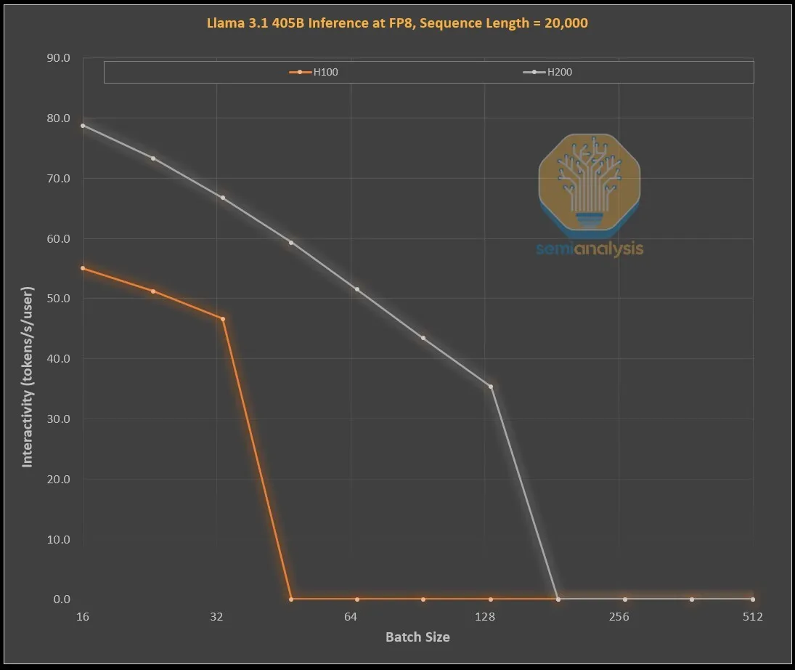

## NVIDIA의 크리스마스 선물: GB300 & B300 – 추론을 추론하기(Reasoning Inference), 아마존, 메모리, 공급망 ##

핵심 키워드: 블랙웰 지연, 마이크로소프트 주문, GB300 원가명세서(BOM), NVIDIA 총이익률, ConnectX-8, 전압 조절 모듈(VRM), 마이크론, 삼성, SK 하이닉스, 위스트론(Wistron), FII 폭스콘(FII Foxconn), 아스피드(Aspeed), 아시아도(Axiado)
 
 
[산타 황](https://www.youtube.com/watch?v=5CX0OcclFvQ) 덕분에 메리 크리스마스가 찾아왔다. NVIDIA의 블랙웰 GPU가 [실리콘, 패키징, 백플레인 문제](https://semianalysis.com/2024/08/04/nvidias-blackwell-reworked-shipment/)로 여러 번 지연된 것은 [여기 기사](https://semianalysis.com/2024/08/04/nvidias-blackwell-reworked-shipment/)와 [액셀레이트 모델](https://semianalysis.com/accelerator-industry-model/)에서 여러 차례 언급되었지만, 그것이 NVIDIA의 끊임없는 전진을 멈추게 하지는 못했다.

    * 참고 : [NVIDIA의 블랙웰 재동작 – 출하 지연 및 GB200A 리워크 플랫폼](https://semianalysis.com/2024/08/04/nvidias-blackwell-reworked-shipment/)

GB200와 B200이 출시된 지 단 6개월 만에 NVIDIA는 새로운 GPU인 GB300과 B300을 시장에 선보이고 있다. 겉보기에는 점진적인 변화처럼 보이지만, 실제로는 훨씬 더 많은 변화가 담겨 있다.

특히, 이번 변화는 [추론 모델의 추론 성능과 학습 성능을 크게 향상시키는](https://github.com/synabreu/SemiAnalysisKor/blob/main/20241211-scalinglaw.md) 중요한 내용을 포함하고 있다. NVIDIA는 이번 크리스마스에 아마존을 비롯한 하이퍼스케일러들, 일부 공급망 플레이어, 메모리 공급업체, 그리고 그들의 투자자들에게 특별한 선물을 제공하고 있다. B300으로의 전환과 함께 전체 공급망이 재편되고 있으며, 이를 통해 많은 승자들이 선물을 받는 반면 일부 패자들은 '벌로 받는 석탄(Coal)'를 받게 될 전망이다. 참고로 '벌로 받는 석탄(Coal)'은 크리스마스 때, 잘못 행동한 어린이가 크리스마스 선물 대신 받는 석탄을 받는다는 이야기에서 유래되었다. 

### 1. 단순한 점진적 업그레이드가 아닌 B300 & GB300 ###

B300 GPU는 TSMC의 4NP 공정 노드에서 새롭게 테이프아웃된 완전히 새로운 디자인으로, 컴퓨트 다이(die)에 최적화된 설계를 적용했다. 이를 통해 B200 대비 제품 수준에서 50% 더 높은 FLOPS를 제공할 수 있다. 이 성능 향상은 일부는 TDP가 GB300과 B300 HGX 각각 1.4KW와 1.2KW로 증가하며(GB200과 B200은 각각 1.2KW와 1KW), 200W의 추가 전력에서 비롯된다.

나머지 성능 향상은 아키텍처 개선과 CPU와 GPU 간 동적 전력 재할당 같은 시스템 수준의 개선에서 비롯된다. 이 동적 전력 재할당, 즉 “전력 슬로싱(Power Sloshing)“은 CPU와 GPU가 서로 간에 전력을 동적으로 재분배하는 기술이다.

FLOPS 증가 외에도 메모리가 8-Hi HBM3에서 12-Hi HBM3E로 업그레이드되어 GPU당 HBM 용량이 288GB로 늘어난다. 그러나 핀 속도는 동일하게 유지되기 때문에 메모리 대역폭은 여전히 GPU당 8TB/s이다. 참고로, 삼성은 적어도 앞으로 9개월 동안 GB200이나 GB300에 진입할 가능성이 없기 때문에, 이번에 산타로부터 석탄(coal)을 받았다.

또한 NVIDIA는 크리스마스 분위기를 맞아 흥미로운 가격 정책을 내놓았다. 이는 블랙웰(Blackwell)의 마진 구조를 변경하게 되지만, 이에 대한 가격과 마진 이야기는 나중에 다룬다. 지금 가장 중요한 것은 성능 변화에 대한 논의다.

### 2. 추론 모델을 위한 설계 ###

메모리 개선은 OpenAI O3 스타일의 LLM 추론 훈련 및 추론에 매우 중요하다. 긴 시퀀스 길이로 인해 KVCache가 증가하면서 중요한 배치 크기와 지연 시간이 제한되기 때문이다. 이 내용은 우리가 추론 모델 훈련, 합성 데이터, 추론 등 여러 가지를 논의했던 스케일링 법칙 방어 글에서 자세히 설명했다. 

      * 참고 : [스케일링 법칙 – O1 Pro 아키텍처, 추론 훈련 인프라, Orion 및 Claude 3.5 Opus의 ‘실패’](https://github.com/synabreu/SemiAnalysisKor/blob/main/20241211-scalinglaw.md)

아래 차트는 NVIDIA의 현재 GPU 세대가 1,000개의 입력 토큰과 19,000개의 출력 토큰을 처리할 때 토크노믹스(tokenomics) 개선 사항을 보여준다. 이는 OpenAI의 o1 및 o3 모델의 체인 오브 소트(chain of thought)와 유사하다. 이 시뮬레이션은 LLAMA 405B 모델을 FP8로 실행한 가상 성능 시뮬레이션으로, H100 및 H200 GPU를 사용하여 수행되었다. 이는 SemiAnalysis가 사용할 수 있는 GPU에서 실행한 결과이다.

[Source: SeminAnalysis]

H100에서 H200으로 업그레이드할 때, 이는 단순히 더 많은 용량과 더 빠른 메모리를 제공하는 업그레이드에 불과하지만, 두 가지 주요 효과가 나타난다.

	1.	전체 배치 크기에서 일반적으로 43% 더 높은 상호작용성. 이는 더 높은 메모리 대역폭(H200: 4.8TB/s vs H100: 3.35TB/s) 덕분
	2.	비용 약 3배 감소. H200이 H100보다 더 높은 배치 크기를 처리할 수 있어 초당 생성 가능한 토큰 수가 3배로 증가함. 이 차이는 주로 KVCache가 총 배치 크기를 제한하기 때문.

더 많은 메모리 용량이 주는 혜택이 불균형적으로 큰 이유는 매우 중요하다. 두 GPU 간 성능 및 경제적 차이는 사양표에서 보여지는 것보다 훨씬 크다.

	1. 추론 모델은 요청과 응답 사이의 긴 대기 시간 때문에 사용자 경험이 나빠질 수 있다. 만약 훨씬 더 빠른 추론 시간을 제공할 수 있다면, 사용자가 이를 더 자주 사용하고 비용을 지불할 가능성이 높아진다. 

	2. 중간 세대 메모리 업그레이드로 하드웨어가 3배 성능을 낸다는 것은 놀라운 일이며, 이는 무어의 법칙, 황의 법칙 등 우리가 지금껏 본 하드웨어 개선 속도를 훨씬 초월한다.
 
	3. 가장 성능이 뛰어나고 차별화된 모델은 약간 덜 성능이 좋은 모델에 비해 상당한 프리미엄을 부과할 수 있다. 최첨단 모델의 총 마진율은 70%를 넘지만, 오픈소스 경쟁이 있는 이전 세대 모델은 20% 이하이다. 추론 모델은 하나의 생각 사슬(chain of thought)로 제한되지 않는다. 검색(search) 기능이 존재하며, 이는 o1 Pro와 o3에서처럼 성능 향상을 위해 확장 가능하다. 이를 통해 더 똑똑한 모델을 구현할 수 있으며, GPU당 훨씬 더 많은 수익을 창출할 수 있다.

물론 NVIDIA만 메모리 용량을 늘릴 수 있는 것은 아니다. ASIC도 이를 구현할 수 있으며, 실제로 AMD는 일반적으로 NVIDIA보다 더 높은 메모리 용량을 갖춘 MI300X의 192GB, MI325X의 256GB, MI350X의 288GB 덕분에 유리한 위치에 있을 수 있다. 하지만 ’산타 황(Santa Huang)’에게는 NVLink라는 붉은 코를 가진 순록이 있다. 

참고로 ASIC(Application-Specific Integrated Circuit)은 특정 용도나 작업을 수행하기 위해 설계된 맞춤형 집적 회로를 말한다. 일반적인 범용 프로세서(CPU 또는 GPU)와 달리, ASIC는 암호화 연산, 네트워크 라우팅, AI 연산와 같은 특정 작업을 매우 효율적으로 처리하도록 설계되어 있다. 

      * 참고 : [NVIDIA Blackwell 성능 TCO 분석 – B100 vs B200 vs GB200 NVL72](https://semianalysis.com/2024/04/10/nvidia-blackwell-perf-tco-analysis/)

GB200 NVL72와 GB300 NVL72로 나아가면서, NVIDIA 기반 시스템의 성능과 비용은 크게 개선된다. NVL72를 추론에 사용하는 핵심 이유는 72개의 GPU가 같은 문제를 해결하면서 메모리를 매우 낮은 지연 시간으로 공유할 수 있게 하기 때문이다. 전 세계 어떤 액셀레이터에도 all-to-all 스위칭 연결성을 제공하지 않으며, 어떤 가속기도 스위치를 통해 올리듀스(All Reduce)를 수행할 수 없다. NVIDIA의 GB200 NVL72와 GB300 NVL72는 여러 중요한 기능을 가능하게 하는 데 있어 다음과 같이 매우 중요한 역할을 한다. 

	•	훨씬 높은 상호작용성을 통해 생각 사슬(chain of thought)당 더 낮은 지연 시간 제공.
	•	72개의 GPU를 활용하여 KVCache를 분산, 훨씬 더 긴 생각 사슬을 만들 수 있게 지능 증가.
	•	일반적인 8 GPU 서버와 비교하여 훨씬 나은 배치 크기 확장성을 제공, 이를 통해 비용 대폭 절감.
	•	동일한 문제를 처리하며 더 많은 샘플을 검색하여 정확도와 모델 성능을 최종적으로 향상.

따라서 NVL72를 사용하면 토크노믹스(tokenomics)가 특히 긴 추론 체인에서 10배 이상 향상된다. KVCache가 메모리를 많이 차지하는 것은 경제성에 치명적이지만, NVL72는 높은 배치 크기로 추론 길이를 100k+ 토큰까지 확장할 수 있는 유일한 방법이다.

참고로, all-to-all 스위칭 연결성은 NVIDIA의 NVLink 및 NVSwitch를 지원하는 기술로 네트워크 또는 시스템에서 모든 노드(GPU, 서버, 장치 등)가 다른 모든 노드와 직접적으로 통신할 수 있는 네트워크 구성 방식을 말한다. 이를 통해 네트워크 상의 각 노드가 다른 모든 노드와 동시에 데이터를 교환할 수 있는 환경을 제공한다. 각 GPU나 노드가 별도의 중간 단계를 거치지 않고 모든 다른 노드와 직접 데이터를 주고받을 수 있으므로 네트워크의 병목을 최소화하여 높은 대역폭과 낮은 지연 시간을 보장하고, All-Reduce, All-Gather, Reduce-Scatter와 같은 집합 연산을 빠르고 효율적으로 분산 후년 수행한다.

특히, 올 리듀스(ll-Reduce)는 분산 컴퓨팅 환경에서 사용되는 중요한 데이터 집합 연산 중 하나로, 여러 노드(또는 GPU)에서 데이터를 계산한 결과를 결합하고, 그 결합된 결과를 다시 각 노드로 분배하는 작업을 한다. 이는 병렬 처리를 사용하는 AI 모델 학습과 같은 워크로드에서 필수적인 연산이다. 주로 NVIDIA Collective Communication Library(NCCL) 과 InfiniBand SHARP 및 NVLink SHARP 에서 사용되었다. 

### 3. GB300을 위해 재구성된 블랙웰 공급망 ###

GB300에서 NVIDIA가 제공하는 공급망과 구성품이 크게 달라진다. [GB200의 경우 NVIDIA는 Blackwell GPU, Grace CPU, 512GB LPDDR5X, VRM 구성품이 모두 통합된 하나의 PCB 포함하는 전체 Bianca 보드](https://github.com/synabreu/SemiAnalysisKor/blob/main/20240717-gb200.md)와 함께 스위치 트레이 및 쿠퍼 백플레인도 제공한다. 

[Source: SemiAnalysis]

GB300의 경우, NVIDIA는 전체 Bianca 보드를 공급하는 대신 B300을 “SXM Puck” 모듈 형태로, Grace CPU는 BGA 패키지로, 그리고 HMC는 GB200에서 사용된 Aspeed 대신 미국 스타트업 Axiado에서 공급받게 된다. 최종 고객은 이제 컴퓨팅 보드의 나머지 구성 요소를 직접 조달하며, 메모리의 두 번째 계층은 납땜된 LPDDR5X 대신 LPCAMM 모듈로 대체된다. 이러한 모듈은 주로 Micron이 공급할 예정이다. 스위치 트레이와 쿠퍼 백플레인은 동일하게 유지되며, NVIDIA가 이 구성품들을 전적으로 공급한다. 

참고로, SXM Puck 모듈은 NVIDIA의 SXM(Switch Module) 기술을 기반으로 한 GPU 모듈의 새로운 폼팩터를 가리킨다. SXM 기술은 고성능 GPU를 데이터센터와 AI 클러스터 환경에서 효율적으로 배치하기 위해 설계된 NVIDIA의 표준 인터페이스이다. “Puck”이라는 명칭은 이 모듈의 크기와 모양이 하키 퍽과 비슷하다는 점에서 유래되었다.

[Source: SemiAnalysis]

SXM Puck으로의 전환은 컴퓨팅 트레이 제조에 더 많은 OEM과 ODM이 참여할 수 있는 기회를 제공한다. 이전에는 Wistron과 FII만이 Bianca 컴퓨팅 보드를 제조할 수 있었지만, 이제는 더 많은 OEM과 ODM이 참여할 수 있게 되었다. ODM 중 Wistron이 가장 큰 손실을 입었으며, Bianca 보드의 점유율을 잃게 된다. 반면, FII는 Bianca 보드 수준에서의 점유율 감소를 겪지만, SXM Puck과 그 Puck이 장착되는 소켓의 독점 제조업체로서 손실을 상쇄하게 된다. NVIDIA는 Puck과 소켓에 대한 다른 공급업체를 확보하려고 시도 중이지만, 아직까지 추가 주문은 이루어지지 않았다.

또 다른 주요 변화는 [전압 조정 모델(VRM,Voltage Regulator Module)](https://semianalysis.com/2023/08/01/energizing-ai-power-delivery-competition/) 콘텐츠와 관련이 있다. 일부 VRM 콘텐츠는 SXM Puck에 포함되어 있지만, 보드 상의 많은 VRM 콘텐츠는 하이퍼스케일러 또는 OEM이 VRM 공급업체로부터 직접 조달하게 된다. 10월 25일, [Core Research 구독자들에게](https://semianalysis.com/core-research/) B300이 전압 조정 모듈(VRM)과 관련된 공급망을 어떻게 재구성하고 있는지에 대한 노트를 발송했다. 특히, [Monolithic Power Systems가 이 비즈니스 모델 전환으로 인해 시장 점유율을 잃게 될 것](https://semianalysis.com/core-research/)이며, 어떤 새로운 업체들이 시장 점유율을 얻고 있는지에 대해 설명했다. 이러한 사실을 다룬 저희의 선도적 연구가 시장에 알려지면서, 고객들에게 노트를 발송한 한 달 후 MPWR의 주가는 37% 이상 하락했다.

NVIDIA는 GB300 플랫폼에서 800G ConnectX-8 NIC도 제공합니다. 이는 InfiniBand와 Ethernet에서 확장 대역폭을 두 배로 늘려준다. NVIDIA는 시간 문제와 Bianca 보드에서 PCIe Gen 6를 활성화하지 않기로 한 결정으로 인해 GB200에서 ConnectX-8을 취소한 바 있다.

ConnectX-8은 ConnectX-7에 비해 엄청난 개선을 제공한다. 대역폭이 2배로 증가할 뿐만 아니라, PCIe 레인이 32개에서 48개로 늘어나 독특한 아키텍처, 예를 들어, 공랭식 MGX B300A와 같은 구성을 가능하게 한다. 또한 ConnectX-8은 SpectrumX를 지원하며, 이전 400G 세대에서는 비효율적인 Bluefield 3 DPU를 필요로 했던 SpectrumX와 비교해 훨씬 효율적이다. 

### 3. GB300이 하이퍼스케일러에 미치는 영향 ###

GB200와 GB300의 출시 지연은 많은 주문이 Q3부터 NVIDIA의 더 비싼 GPU인 GB300으로 이동하게 되는 결과를 초래했다. 지난주 기준으로, 모든 하이퍼스케일러들이 GB300을 도입하기로 결정했다. 이는 GB300이 제공하는 더 높은 FLOPS와 메모리 용량 때문이기도 하지만, 하이퍼스케일러들이 자신들의 하드웨어 및 구성에 더 많은 통제권을 가질 수 있기 때문이기도 하다.

GB200의 출시 당시 시장 진입 속도와 랙, 냉각, 전력 공급/밀도와 같은 요소에서의 제약으로 인해, 하이퍼스케일러들은 서버 수준에서 GB200의 구성을 크게 변경할 수 없었다. 이로 인해, Meta는 Broadcom과 NVIDIA NIC을 멀티 소싱할 수 있는 가능성을 포기하고 NVIDIA에만 의존하기로 했다. Google의 경우, 자체 개발한 NIC을 포기하고 NVIDIA의 NIC만을 사용하기로 했다.

이는 비용 최적화를 위해 CPU부터 네트워킹, 심지어 나사와 금속판까지 모든 것을 조정하는 데 익숙한 수천 명 규모의 하이퍼스케일러 조직들에게는 “칠판 긁는 소리”와도 같았다. 가장 극단적인 예는 Amazon이었는데, Amazon은 레퍼런스 설계보다 더 나쁜 총 소유 비용(TCO)을 가진 매우 비효율적인 구성을 선택했다. Amazon은 NVL72 랙을 Meta, Google, Microsoft, Oracle, X.AI, Coreweave처럼 배치하지 못했으며, 이는 PCIe 스위치와 공냉식이 필요한 200G Elastic Fabric Adaptor NIC의 덜 효율적인 사용 때문이었다. Amazon은 자체 NIC을 사용해야 했기 때문에 NVL36을 사용해야 했으며, 이는 더 높은 백플레인과 스위치 비용으로 인해 GPU당 비용이 증가할 수 밖에 없었다. 결국, Amazon의 구성은 맞춤화 제약으로 인해 최적화되지 못한 사례로 남았다.

이제 GB300으로 하이퍼스케일러들은 메인보드, 냉각 시스템 등 많은 것을 맞춤화할 수 있다. 이로 인해 Amazon은 자체 맞춤형 메인보드를 제작할 수 있게 되었으며, 기존에 공랭식으로 운영되던 Astera Labs PCIe 스위치와 같은 부품들을 통합하여 수랭식으로 전환할 수 있다. 더 많은 부품을 수랭식으로 운영하고, 2025년 3분기에 K2V6 400G NIC의 대량 생산(HVM)이 이루어짐에 따라, Amazon은 NVL72 아키텍처로 복귀하여 총 소유 비용(TCO)을 크게 개선할 수 있다.

그러나 한 가지 큰 단점이 있다. 하이퍼스케일러들은 훨씬 더 많은 설계, 검증 및 검사를 수행해야 한다는 점이다. 이는 하이퍼스케일러들이 지금까지 설계해 본 플랫폼 중 가장 복잡한 플랫폼이라고 할 수 있다.(단, Google의 TPU 시스템은 제외). 일부 하이퍼스케일러들은 이 작업을 빠르게 진행할 수 있지만, 설계 팀 속도가 느린 다른 회사들은 뒤처질 가능성이 있다. 일반적으로 시장에서의 취소 보고에도 불구하고 Microsoft는 설계 속도 때문에 GB300 배포가 가장 느린 편이며, 4분기에도 여전히 일부 GB200을 구매하고 있는 것으로 보인다.

고객이 지불하는 총 가격은 NVIDIA의 마진 스태킹에서 부품이 빠져나가면서 ODM으로 전환됨에 따라 크게 달라진다. 이는 ODM의 매출에도 영향을 미치며, 무엇보다도 NVIDIA의 총 마진도 연중 변화하게 됩니다. 아래에서 이러한 영향을 보여드리겠다. (이 부분은 유료) 

