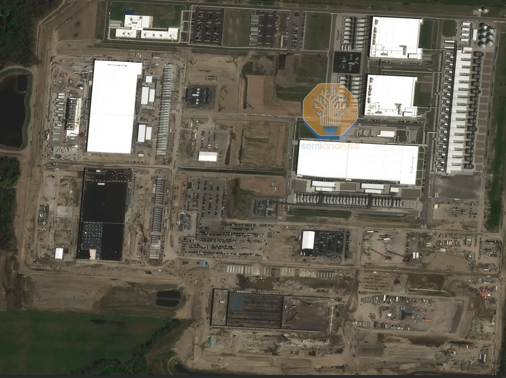
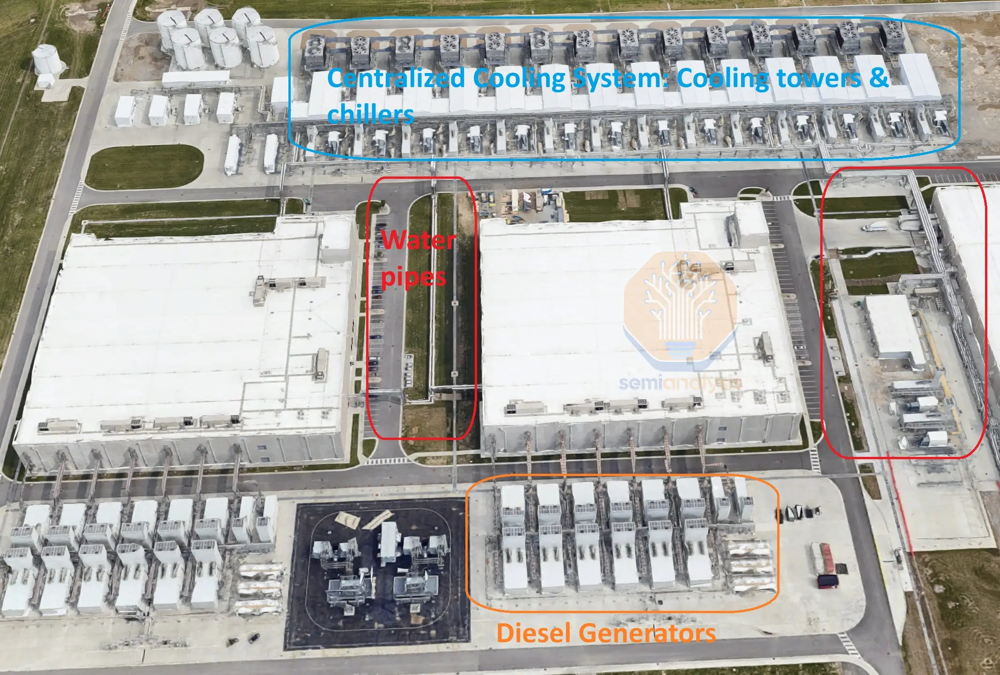
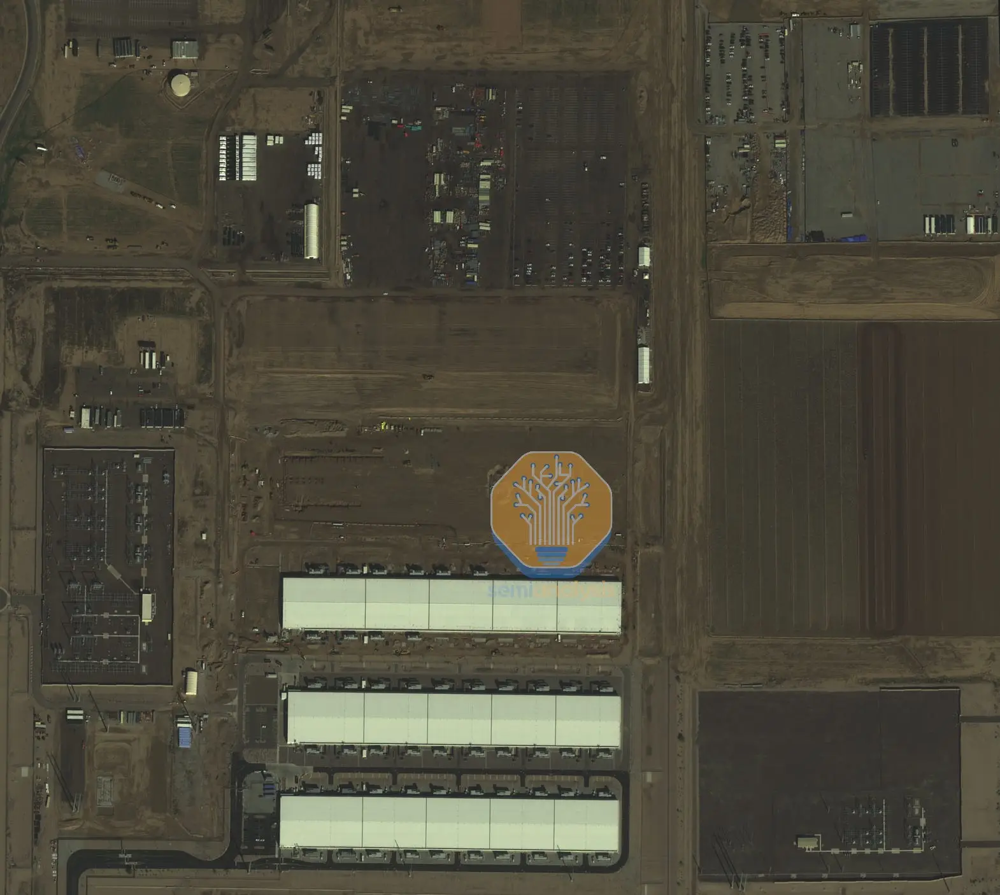
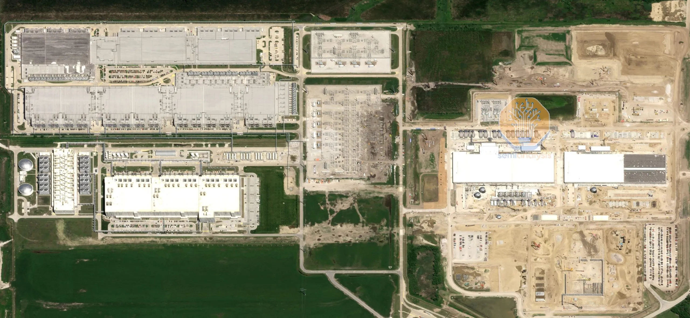
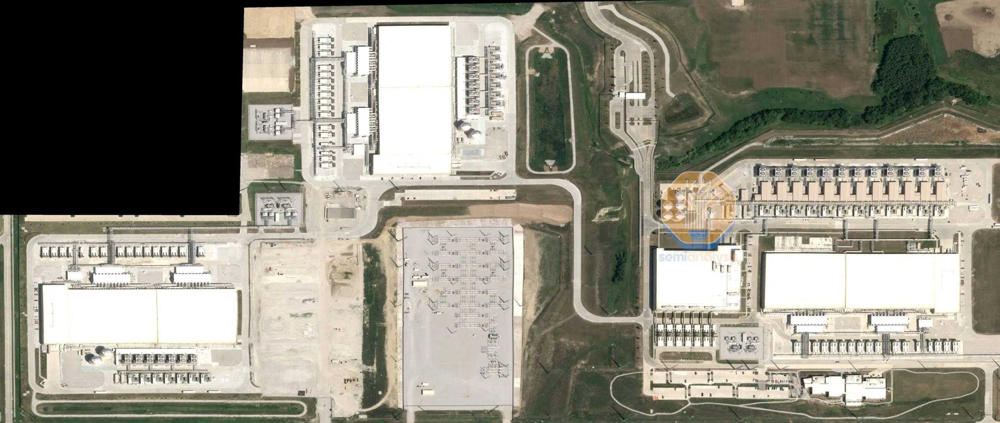

### 멀티 데이터센터 학습: 구글의 인프라를 넘어서는 OpenAI의 야심찬 계획 ###

##### 
핵심 요약: 기가와트 클러스터, 통신 네트워킹, 장거리 광섬유, 계층적 및 비동기 SGD, 분산 인프라의 승자들
 #####

##### AI 인프라 구축은 스케일링 법칙을 지속적으로 추진하는 데서 오는 개선으로 인해 그 수요가 끝이 없다. 최첨단 AI 모델 학습 클러스터는 올해 10만 개의 GPU로 확장되었으며, 2025년에는 30만 개 이상의 GPU 클러스터가 준비 중이다. 데이터센터 건설 일정, 허가, 규제, <a href="https://semianalysis.com/2024/03/13/ai-datacenter-energy-dilemma-race/" target="_blank">전력 가용성</a> 등 여러 물리적 제약을 고려할 때, 단일 데이터센터에서 대규모 모델을 동기식으로 학습시키는 전통적인 방식은 한계점에 다다르고 있다. #####
##### 구글, 오픈AI, 앤트로픽은 이미 단일 사이트에서 여러 데이터센터 캠퍼스로 대규모 모델 학습을 확장하기 위한 계획을 실행 중이다. 구글은 오늘날 세계에서 [가장 앞선 컴퓨팅 시스템을](https://semianalysis.com/2023/04/12/google-ai-infrastructure-supremacy/) 보유하고 있으며, 랙 단위 액체 냉각 아키텍처 및 멀티 데이터센터 학습과 같은 핵심 기술의 대규모 사용을 개척하여 이제야 다른 기업들이 이를 도입하기 시작했다. #####
##### Gemini 1 Ultra는 여러 데이터센터에서 학습되었다. 구글은 더 많은 FLOPS(연산 능력)를 사용할 수 있었음에도 불구하고, 합성 데이터, 강화 학습(RL), 모델 아키텍처 측면에서 뒤처져 있는 탓에 기존 모델들이 오픈AI와 앤트로픽보다 뒤처져 있다. 그러나 Gemini 2의 출시가 임박하면서 이 상황은 바뀔 것으로 보인다. 또한, 구글은 2025년까지 여러 캠퍼스에서 기가와트(Gigawatt) 규모의 학습 작업을 수행할 수 있는 능력을 갖추게 된다. 하지만 놀랍게도 구글의 장기 계획은 오픈AI와 마이크로소프트만큼 공격적이지 않다. #####

 출처: Google

##### 대부분의 기업은 이제 막 [Nvidia의 GB200 아키텍처](https://semianalysis.com/2024/07/17/gb200-hardware-architecture-and-component/)를 기반으로 한 고밀도 액체 냉각 AI 칩에 도입되고 있으며, 내년에는 수백만 개의 유닛으로 확대될 예정이다. 반면, 구글은 이미 액체 냉각 TPU를 수백만 개 배치하여 1기가와트(GW)가 넘는 액체 냉각 AI 칩 용량을 확보하고 있다. 구글의 인프라와 경쟁사의 인프라 간의 뚜렷한 차이는 누구나 쉽게 확인할 수 있을 정도로 명확하다. #####

<a href="https://semianalysis.com/2024/03/13/ai-datacenter-energy-dilemma-race/" target="_blank" align="left" style="color: gray;" size="10" target="_blank">출처: SemiAnalysus Datacenter Model</a>

##### 위에 표시된 AI 학습 캠퍼스는 이미 약 300MW의 전력 용량을 갖추고 있으며, 내년에는 500MW로 확장될 예정이다. 이러한 규모뿐만 아니라, 이 시설들은 매우 높은 에너지 효율성을 자랑한다. 아래에서는 대형 냉각탑과 중앙 집중식 시설용수 시스템이 세 건물을 연결하는 물 파이프와 함께 작동하며, 약 200MW의 열을 방출할 수 있는 시스템을 볼 수 있다. 이 시스템 덕분에 Google은 대부분의 기간 동안 냉각기를 사용하지 않고도 운영할 수 있으며, 2023년 최신 환경 보고서에 따르면 1.1 PUE(Power Usage Effectiveness(PUE)를 달성했다. #####

출처: Google

##### 위 사진에는 시설용수 시스템만 보이지만, 물은 또한 Direct-to-Chip 시스템을 통해 랙으로 직접 전달된다. Liquid-to-Liquid 열 교환기가 랙에서 발생한 열을 중앙 시설용수 시스템으로 전달하는 방식이다. 이 매우 에너지 효율적인 시스템은 Nvidia GB200의 L2L(Liquid-to-Liquid) 배치 방식과 유사하며, 이는 [GB200 심층 분석](https://semianalysis.com/2024/07/17/gb200-hardware-architecture-and-component/)에서 자세히 설명되어 있다. #####

##### 반면, 아래에 표시된 Microsoft의 현재 최대 학습 클러스터는 액체 냉각을 지원하지 않으며, 건물의 총 바닥 면적(GFA)이 유사함에도 불구하고 건물당 IT 용량이 약 35% 낮다. 공개된 데이터에 따르면 Microsoft의 PUE는 1.223이지만, PUE 계산 방식은 공랭식 시스템(air-cooled systems)에 유리하다. 이는 서버 내부의 팬 전력이 제대로 고려되지 않기 때문이다. 공랭식 H100 서버의 경우 팬 전력은 서버 전력의 15% 이상을 차지하는 반면, 액체 DLC 냉각 서버는 5% 미만이다. 따라서 칩에 전달되는 전력 1와트당 Microsoft는 서버 팬 전력, 시설 냉각 및 기타 비-IT 부하(non-IT load)로 추가적으로 약 45% 이상의 전력을 요구하는 반면, Google은 IT 전력 1와트당 약 15%의 추가 부하만 필요하다. 여기에 TPU의 더 높은 효율성을 더하면, Microsoft와 Google 간의 차이는 더욱 명확해진다. #####

 

 출처: [SemiAnalysus Datacenter Model](https://semianalysis.com/datacenter-industry-model/)

##### 게다가, 사막 지역(애리조나)에서 적절한 에너지 효율성을 달성하기 위해 Microsoft는 많은 양의 물을 필요로 한다. WUE(Water Usage Effectiveness) 비율은 2.24(L/kWh)로, 그룹 평균인 0.49와 Google 평균인 약 1을 훨씬 초과한다. 이 높은 물 사용량은 부정적인 언론 보도를 초래했으며, Microsoft는 해당 캠퍼스의 향후 데이터센터에 대해 공랭식 냉각기(air-cooled chillers)로 전환하라는 요구를 받았다. 이 전환으로 건물당 물 사용량은 줄어들겠지만, PUE(Power Usage Effectiveness)는 더욱 증가하게 되어 Google과의 에너지 효율성 격차는 더 벌어질 것이다. 향후 보고서에서는 데이터센터의 작동 방식과 일반적인 하이퍼스케일러 설계에 대해 훨씬 더 자세히 다룰 예정이다. #####
##### 따라서, 기존 데이터센터 참조 설계를 기준으로 볼 때, 구글은 훨씬 더 효율적인 인프라를 보유하고 있으며, 각 건물의 IT 부하당 전력 용량이 50% 이상 높고 유틸리티 전력 계약이 덜 필요하다는 점에서 더 빠르게 메가와트(MW)급 시설을 구축할 수 있다. #####

### 1. Google’s AI Training Infrastructure ###

##### Google은 항상 독특한 방식으로 인프라를 구축해 왔다. 오늘날 Google의 개별 데이터센터 설계는 Microsoft, Amazon, Meta보다 더 진보되어 있지만, 이는 Google이 가진 전체적인 인프라적 우위를 완전히 보여주지는 못한다. Google은 또한 10년 이상 대규모 캠퍼스를 구축해 왔다. 아래에 보이는 아이오와 주 Council Bluffs 사이트는 이를 잘 보여주는 사례로, [서쪽 부분에만 약 300MW의 IT 용량을 갖추고 있다.](https://semianalysis.com/datacenter-industry-model/) 이 사이트는 여러 해 전에 건설되었음에도 불구하고 상당한 용량을 자랑한다. 이 중 일부 용량은 전통적인 워크로드에 할당되어 있지만, [하단에 위치한 건물은 다수의 TPU를 보유하고 있을 것](https://semianalysis.com/accelerator-industry-model/)으로 보인다. Google은 가장 최신 데이터센터 설계를 반영한 동쪽 확장을 통해 AI 학습 용량을 더욱 늘릴 계획이다. #####

<a href="https://semianalysis.com/2024/03/13/ai-datacenter-energy-dilemma-race/" target="_blank" align="left" style="color: gray;" size="10" target="_blank">출처: SemiAnalysus Datacenter Model</a>

##### Google의 가장 큰 AI 데이터센터들은 서로 가까운 거리에 위치해 있다. Google은 **오하이오(Ohio)**와 **아이오와/네브래스카(Iowa/Nebraska)**에 두 개의 주요 멀티 데이터센터 지역을 보유하고 있다. 현재 Council Bluffs 주변 지역은 기존 용량의 두 배 이상으로 확장되고 있다. 위에서 언급한 캠퍼스 외에도, Google은 이 지역에 세 곳의 추가 부지를 소유하고 있으며, 이 부지들은 모두 건설 중이며 고대역폭 광섬유 네트워크로 업그레이드되고 있다. #####

<a href="https://semianalysis.com/2024/03/13/ai-datacenter-energy-dilemma-race/" target="_blank" align="left" style="color: gray;" size="10" target="_blank">출처: SemiAnalysus Datacenter Model</a>

##### 세 곳의 부지는 서로 약 15마일 거리에 위치해 있으며, 각각 Council Bluffs, Omaha, **Papillion(Iowa)**에 있다. 또 다른 부지는 약 50마일 떨어진 **Lincoln(Nebraska)**에 위치해 있다. 아래에 보이는 Papillion 캠퍼스는 Omaha와 Council Bluffs 주변에 250MW 이상의 용량을 추가하며, 이를 합치면 2023년 기준 총 500MW 이상의 용량을 갖추게 된다. 이 중 상당 부분은 TPU에 할당되어 있다. #####

<a href="https://semianalysis.com/2024/03/13/ai-datacenter-energy-dilemma-race/" target="_blank" align="left" style="color: gray;" size="10" target="_blank">출처: SemiAnalysus Datacenter Model</a>

##### 나머지 두 곳의 부지는 아직 규모가 크지는 않지만 빠르게 확장 중이며, 네 개의 캠퍼스를 모두 합치면 2026년까지 기가와트(GW) 규모의 AI 학습 클러스터가 형성될 것이다. 약 50마일 떨어진 Lincoln 데이터센터는 Google의 가장 큰 개별 부지가 될 예정이다. #####
##### Google의 거대한 TPU 네트워크는 여기서 멈추지 않는다. 또 다른 기가와트급 클러스터는 오하이오주 콜럼버스(Columbus, Ohio) 지역에 위치해 있다. 이 지역은 유사한 설계를 따르고 있으며, 세 개의 캠퍼스가 개발 중이고 2025년 말까지 총 **1기가와트(GW)**에 이를 것으로 예상된다! #####

<a href="https://semianalysis.com/2024/03/13/ai-datacenter-energy-dilemma-race/" target="_blank" align="left" style="color: gray;" size="10" target="_blank">출처: SemiAnalysus Datacenter Model</a>

##### 아래에 표시된 New Albany 클러스터는 Google의 가장 큰 클러스터 중 하나로 성장할 예정이며, 이미 TPU v4, v5, v6를 운영 중이다. #####

<a href="https://semianalysis.com/2024/03/13/ai-datacenter-energy-dilemma-race/" target="_blank" align="left" style="color: gray;" size="10" target="_blank">출처: SemiAnalysus Datacenter Model</a>

##### Google의 오하이오(Ohio)와 아이오와/네브래스카(Iowa/Nebraska) 집중 지역은 추가적으로 상호 연결되어 단일 모델 학습에 수 기가와트의 전력을 제공할 수 있을 것이다. 우리는 [Datacenter Model을 통해 5,000개 이상의 데이터센터에 대한 분기별 과거 및 예측 전력 데이터를 정확히 상세히 제공한다.](https://semianalysis.com/datacenter-industry-model/) 여기에는 AI 연구소, 하이퍼스케일러, 네오클라우드, 엔터프라이즈를 위한 클러스터 구축 현황이 포함되어 있다. 멀티 데이터센터 학습을 위한 소프트웨어 스택과 방법에 대한 내용은 이 보고서 후반부에서 더 자세히 다룰 예정이다. #####
