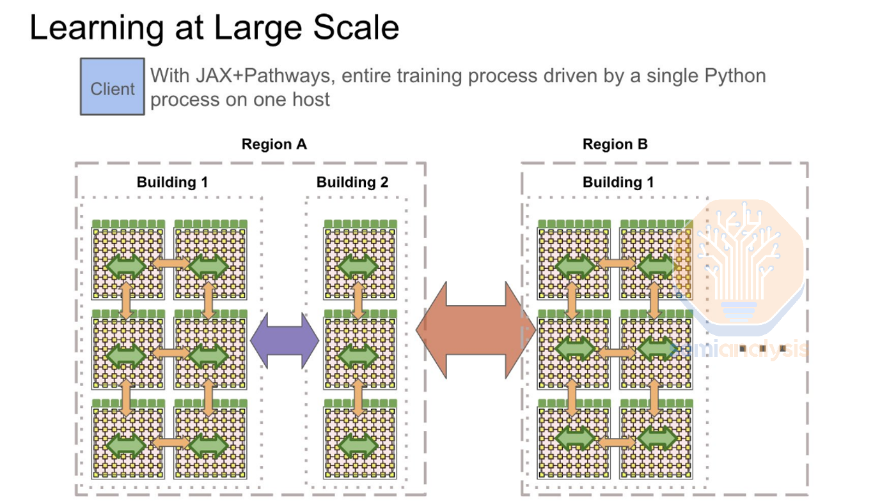

### 멀티 데이터센터 학습: 구글의 인프라를 넘어서는 OpenAI의 야심찬 계획 ###

##### 핵심 요약: 기가와트 클러스터, 통신 네트워킹, 장거리 광섬유, 계층적 및 비동기 SGD, 분산 인프라의 승자들 ####

##### AI 인프라 구축은 스케일링 법칙을 지속적으로 추진하는 데서 오는 개선으로 인해 그 수요가 끝이 없다. 최첨단 AI 모델 학습 클러스터는 올해 10만 개의 GPU로 확장되었으며, 2025년에는 30만 개 이상의 GPU 클러스터가 준비 중이다. 건설 일정, 허가, 규제, 전력 가용성 등 여러 물리적 제약을 고려할 때, 단일 데이터센터에서 대규모 모델을 동기식으로 학습시키는 전통적인 방식은 한계점에 다다르고 있다. #####

##### 구글, 오픈AI, 앤트로픽은 이미 단일 사이트에서 여러 데이터센터 캠퍼스로 대규모 모델 학습을 확장하기 위한 계획을 실행 중이다. 구글은 오늘날 세계에서 가장 앞선 컴퓨팅 시스템을 보유하고 있으며, 랙 단위 액체 냉각 아키텍처 및 멀티 데이터센터 학습과 같은 핵심 기술의 대규모 사용을 개척하여 이제야 다른 기업들이 이를 도입하기 시작했다. #####

##### Gemini 1 Ultra는 여러 데이터센터에서 학습되었다. 구글은 더 많은 FLOPS(연산 능력)를 사용할 수 있었음에도 불구하고, 합성 데이터, 강화 학습(RL), 모델 아키텍처 측면에서 뒤처져 있는 탓에 기존 모델들이 오픈AI와 앤트로픽보다 뒤처져 있다. 그러나 Gemini 2의 출시가 임박하면서 이 상황은 바뀔 것으로 보인다. 또한, 구글은 2025년까지 여러 캠퍼스에서 기가와트(Gigawatt) 규모의 학습 작업을 수행할 수 있는 능력을 갖추게 된다. 하지만 놀랍게도 구글의 장기 계획은 O오픈AI와 마이크로소프트만큼 공격적이지 않다. #####

 

